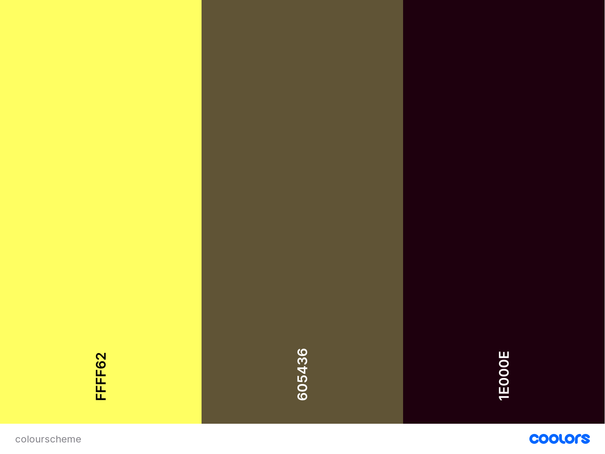
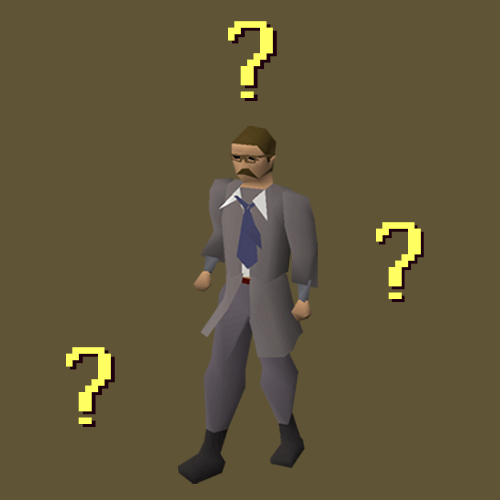

<h1 align="center">General Gielinor Game</h1>

[View a live version of the site here.](https://joeyyscott.github.io/general-gielinor-game/)

I have created this project (Milestone project 2) as part of my Full Stack Web Development course with [Code Institute](https://codeinstitute.net/).

General Gielinor Game is an interactive quiz designed to help you improve your knowledge about the game [RuneScape](https://www.runescape.com). I have been playing this game since 2001 and have such acquired a lot of game knowledge, so I thought what better idea for a interactive game?

---

## Contents

- [**User Experience Design (UXD)**](<#user-experience-design>)

  - [Project Goals](<#project-goals>)
  - [Content Requirements](<#content-requirements>)
  - [Importance and Feasibility chart](<#importance-and-feasibility-chart>)
  - [User Stories](<#user-stories>)
  - [Website Structure](<#website-structure>)
  - [Design Decisions from UXD](<#design-decisions-from-uxd>)
    - Colour Scheme
    - Images
    - Typography
  - [Wireframes](<#wireframes>)
  - [Design Changes](<#design-changes>)

- [**Features**](#features)

- [**Technologies**](#technologies)

- [**Testing**](#testing)

- [**Deployment**](#deployment)

- [**Credits**](#credits)
  
  ___

## User Experience Design

### Project Goals

The idea is to create an interactive general knowledge game about RuneScape an MMORPG (Massively multiplayer online role playing game). The game will help players gain more knowledge of the game and when a correct answer is given they are presented with the reasoning behind the question and why it is correct. There are wrong answers but you will not be punished for learning. It is a crucial part of understanding any concept, we are all learing everyday, including me. As a veteran player myself, I have an abundance of Runescape knowledge and I hope to inspire players to learn more about the game.

### Content Requirements

The main points I want to achieve with this project are:

+ To showcase my skills as a Web Developer using HTML, CSS and JavaScript.
+ To provide users with an interactive game to teach them about RuneScape.
+ To create an environment where users feel welcomed and want to learn.
+ To build a game that not only provides knowledge but the reasoning behind it.

### Importance and Feasibility chart

Opportunity/Problem | Importance | Viability/Feasibility
:-------- |:--------:|:--------:
A. Information on why answers are correct | 5 | 5
B. Game instructions | 5 | 5
C. Game start button | 5 | 4
D. Different themes of questions | 5 | 2
E. Repeat button after quiz | 5 | 4

### User stories

- #### User goals

    + As a **user**, I want to understand the website's purpose on my first visit.
    + As a **user**, I want to easily be able to use the desired function of the site.
    + As a **user**, I want to expand my RuneScape game knowledge in an intuitve way.
    + As a **user**, I want to be able to view and use the site on any device.  
    + As a **user**, I want to see other work the site owner has created.
    + As a **user**, I want to be able contact the site owner with any questions I would like to see added.
    + As a **user**, I want to be able to navigate through the whole site smoothly.
    + As a **user**, I want to know if my guess was correct or not and why.
    + As a **user**, I want a way to initiate the game on my action.
    + As a **user**, I want to learn more about the game RuneScape.
    + As a **user**, I want a way to return to the home page after the quiz has ended.
    + As a **user**, I want to enjoy playing and learning in General Gielinor Game.

- #### Site Owner Goals

	+ As a **site owner**, I want the user to be greeted with a brief introduction message and a run down on how to play the game so they can easily understand the whole website.
	+ As a **site owner**, I want the user to be able to intuitively navigate the entire site on their first visit.
	+ As a **site owner**, I want to include links to my GitHub and LinkedIn profile so the user can view other projects I have contributed to.
	+ As a **site owner**, I want to create an engaging, interactive experience through the quiz and site. 
	+ As a **site owner**, I want to create a site that provides a welcoming atmosphere to learn about RuneScape.
	+ As a **site owner**, I want to provide the user with feedback about whether their answer is correct or not and the reasoning why after each question.
	+ As a **site owner**, I want to create a quiz that will help users learn about the MMORPG RuneScape.
	+ As a **site owner**, I want to include a form within a modal that can be accessed anywhere and allows the user to suggest questions for the quiz.

### Website Structure


+ This project is aimed at either new, returning or veteran RuneScape players and I wanted to recreate the traditional RuneScape feel with my design. You experience the classic RuneScape vibe from how you are presented with the area that displays the quiz to the colours throughout the project.

+ I wanted to keep the design of the website simple so as not to distract the user from the main content of the site.

+ The site is entirely in **index.html** which includes the welcome screen with quiz instructions and a way to initiate the quiz. There will be a home button on the top left of the site to follow modern conventions.

###  Design Decisions from UXD

#### Colour Scheme



Using a combination of [coolors.co](https://coolors.co/) and [Accessible Color Generator Tool](https://learnui.design/tools/accessible-color-generator.html) I was able to create a colour scheme that fits in with RuneScape's vibe and traditional colours. 

#### Images



+ The quizmaster image comes from the Old School RuneScape Wiki page for [him](https://oldschool.runescape.wiki/w/Quiz_Master). The rest of the image was created in GIMP and will be tiled across the site.
+ All other images come from the official [RuneScape wiki](https://runescape.wiki/). 

#### Typography

To keep with the intended RuneScape style I have picked a singular font (RuneScape UF). Through the use of Transfonter as mentioned in the Technologies and Credits sections I was able to import this custom font into my site which allows for the user to feel the complete RuneScape experience.

### Wireframes

|                                                   Mobile                                                  |                                                 Tablet                                                    |                                                 PC                                                    |
| :-------------------------------------------------------------------------------------------------------: | :-------------------------------------------------------------------------------------------------------: | :---------------------------------------------------------------------------------------------------: |
| [index.html](https://github.com/JoeyyScott/general-gielinor-game/blob/master/wireframes/index-mobile.png) | [index.html](https://github.com/JoeyyScott/general-gielinor-game/blob/master/wireframes/index-tablet.png) | [index.html](https://github.com/JoeyyScott/general-gielinor-game/blob/master/wireframes/index-pc.png) |
| [Quiz Screen](https://github.com/JoeyyScott/general-gielinor-game/blob/master/wireframes/quiz-mobile.png) | [Quiz screen](https://github.com/JoeyyScott/general-gielinor-game/blob/master/wireframes/quiz-tablet.png) | [Quiz screen](https://github.com/JoeyyScott/general-gielinor-game/blob/master/wireframes/quiz-pc.png) |

### Design changes

#### [Back to top](#contents)

---

## Features

### Existing Features

The header can be accessed and viewed throughout all stages of the quiz.

Included in the **header** is: 

+ **Home Icon**: Provides a link to the homepage to allow the user to return there.
+ **'Find out more' button**: Allows the user to initiate a modal which provides information about the quiz and RuneScape in general.

Included in the **main quiz** is:

+ **Multiple choice questions** - Contains up to 30 questions of which 10 will be shown throughout the quiz.
    + Each question contains 4 answers.
    + The question order is randomized so users do not feel repetition.

+ **Guess response** - When the user has a guess at a question they are presented with one of two responses:
    + If their response is correct the user will have their answer reaffirmed, are presented with some supporting information and given a link to the associated RuneScape Wikipedia page.
    + If their response is incorrect the user will be notified that their guess was incorrect and a hint as to how they might the answer to the question.

+ **Responsive Design** - The quiz is responsive on all screen sizes and has been designed with a mobile first approach.
    + Media queries for scaling rules across device proportions.
    + Media query for small height screens to push the main quiz container up as to avoid content overlap.

Included in the **footer** is:
+ **Suggest a question** - Opens a modal which allows user to suggest a question for the quiz and 4 associated answers.
    + The form functionality is handled by emailJS.
+ **Github icon** - Opens up my Github profile in a new tab for user retention.
+ **LinkedIn icon** - Opens up my LinkedIn profile in a new tab for user retention.

---

## Technologies

### Languages

+ [HTML](https://en.wikipedia.org/wiki/HTML) - Used as the main language for structuring the website.
+ [CSS](https://en.wikipedia.org/wiki/CSS) - Used as the main language for styling the website.

### Frameworks, libraries and programs
+ [GIMP](https://www.gimp.org) - I used this program to design the background image and wireframes.
+ [coolors.co](https://coolors.co) - I used this tool to generate a colour scheme based on the RuneScape theme.
+ [Accessible Color Generator](https://learnui.design/tools/accessible-color-generator.html) - I used this tool in conjunction with coolors.co to provide a better colour contrast for accessibility. 
+ [Transfonter](https://transfonter.org/) - A tool I used to generate the accompanying font files for my custom RuneScape Font.
+ [Font Awesome](https://fontawesome.com/) - I used the Font Awesome icon library to provide icons for some of my hints, my home button and my footer links. 
+ [Bootstrap](https://getbootstrap.com/) - The Bootstrap framework is being used to organize and position my answers within my quiz container using the grid system. It also handles the JavaScript for the site's modals.
+ [GitPod](https://gitpod.io) - GitPod was the online IDE (Integrated Development Engine) I used to develop this site.
+ [Git](https://git-scm.com) - Git is an open source version control system where you can commit changes to the associated Github repository and push changes to Github pages.

#### [Back to top](#contents)

---

## Testing


#### [Back to top](#contents)

---

## Deployment

### Project Inception

1. This project was created using [GitHub](https://github.com) and Code Institute's project template [here](https://github.com/Code-Institute-Org/gitpod-full-template) by clicking "Use this template".
2. I named this project "general-gielinor-game" as it is the name of the quiz on the website.
3. Once the repository had been created I clicked the "Gitpod" button which is a Firefox extension ([here](https://addons.mozilla.org/en-GB/firefox/addon/gitpod/)) that creates a workspace within GitPod which is where I coded the project.
4. Following [Code Institute's](https://codeinstitute.net/) lessons the 4 main commands I used were:
    + ```git status``` (which allows me to check which files have been modified and if any are ready to be committed)
    + ```git add .``` (which adds all changed files within my project's directory to be committed)
    + ```git commit -m "[TYPE] Reason"``` (which commits all changes to my project using a category prefix and a specific reason for that commit)
    + ```git push``` (this command pushes all committed changes to the live version of my site on Github Pages)

### Deploying to Github pages

To achieve deployment I used this process:

1. After pushing my project to GitHub, I navigated and logged into the GitHub site.
2. I then went to my repositories and selected the one associated to this project: [General Gielinor Game Repository](https://github.com/JoeyyScott/general-gielinor-game).
3. On the main repository bar I clicked "Settings" and scrolled to "Github Pages".
4. Under "Source" dropdown box I selected "Master Branch" and clicked "Save".
5. After the page refreshed I returned to the "Github Pages" section for the live link to the published site.

The live link for the site is here: [https://joeyyscott.github.io/general-gielinor-game/](https://joeyyscott.github.io/general-gielinor-game/)

### Creating a local clone

1. Open GitHub and locate the associated GitHub repository [here](https://github.com/JoeyyScott/general-gielinor-game/).
2. In the section that contains the Go to file, Add File and Code buttons, click the dropdown box on code.
3. Of the options available the one I chose is to copy the link to the repository whilst having "HTTPS" selected.
4. Open your desired terminal (built in on your computer or in an IDE) and directory.
5. Type ```git clone``` with the URL after it and press enter to create a local clone at your desired local location.

#### [Back to top](#contents)

---

## Credits

### Content

This section includes areas/sections of code and properties I was unaware of. I have also included sources from where I have adapted/changed code used in the projects throughout my course as I figured it was better practice to state as such to avoid any penalizations or copyright violations.

+ Custom Font CSS - Entire project uses this font and I used [Transfonter](https://transfonter.org/) to convert my TTF file and provide the other file types. It came with a prebuilt css font-face rule that I modified for my project.
+ forEach loops for answers - I wanted to include this under credits as I previously had no knowledge of this functionality. I found [this post](https://stackoverflow.com/questions/38421546/loop-dataset-chartjs-javascript) which is about looping through an array using the forEach function. I also read up on MDN web docs about the forEach function [here](https://developer.mozilla.org/en-US/docs/Web/JavaScript/Reference/Global_Objects/Array/forEach). By combining these two articles and reading through various code snippets I managed to get my answers loading correctly.


### Media

+ The pictures used in this site (in questions and answers) were primarily taken from the official [RuneScape Wiki](https://runescape.wiki/).
+ The Jagex logo was taking from the Wikipedia page for them [here](https://en.wikipedia.org/wiki/Jagex/).

### Acknowledgments

The [Code Institute](https://codeinstitute.net/) slack community for their ongoing support, help and patience with any issues I had pertaining to all aspects of the project.

My mentor [Precious Ijege](https://www.linkedin.com/in/precious-ijege-908a00168/) for all of his help throughout our project calls and feedback on my work.

My family and friends who have helped me test various different versions of the quiz throughout the development process and proof reading my questions/answers along with my README.md / TESTING.md files.

On a final note, I have enjoyed working on this project and am excited for the next stage ahead of me in this [Full Stack Web Development course](https://codeinstitute.net/full-stack-software-development-diploma/). 

#### [Back to top](#contents)

---
